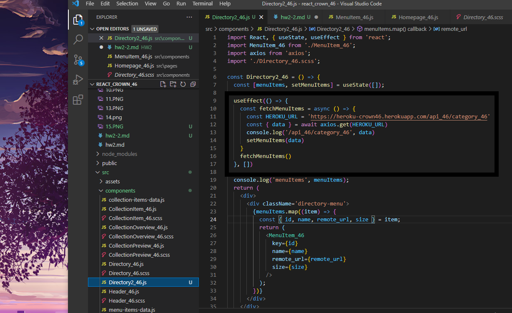
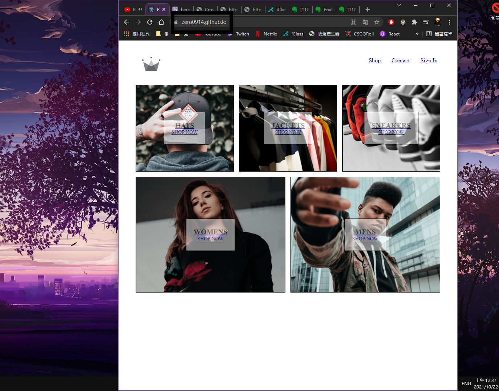
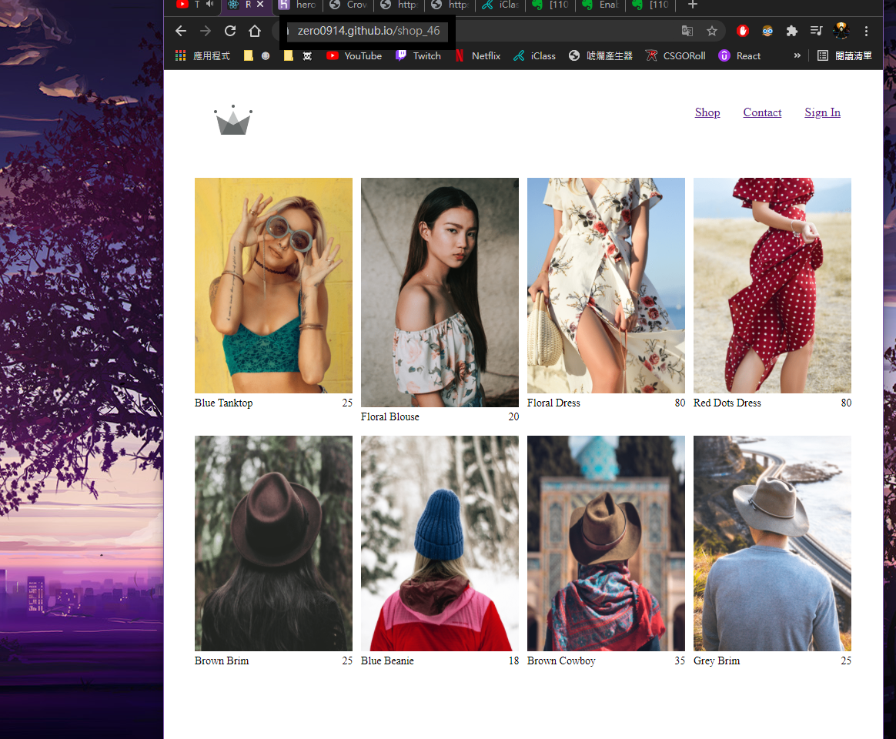

8. (local) 首頁 category 五筆資料，能夠透過你個人放在 Heroku /api_xx/category_xx 取得。如果無法成功，可以先用老師的測試。

- local 執行結果

- Directory2_xx 相關程式截圖

- [Heroku app URL](https://heroku-crown46.herokuapp.com/)

* [Heroku Database URL](https://heroku-crown46.herokuapp.com/api_46/category_46)

---
9. (Github page) 上第8題，請將程式碼發佈到 github page，並能直接從Github page執行，自Heroku /api_xx/category_xx 取得category五筆資料，要繳交
- [Github repo URL](https://github.com/zero0914/react_crown_46)
- [Github page URL](https://zero0914.github.io/)
- Chrome 圖片有關 Github page 執行路由 /  結果

- Chrome 圖片有關 Github page 執行路由 /shop_xx 結果